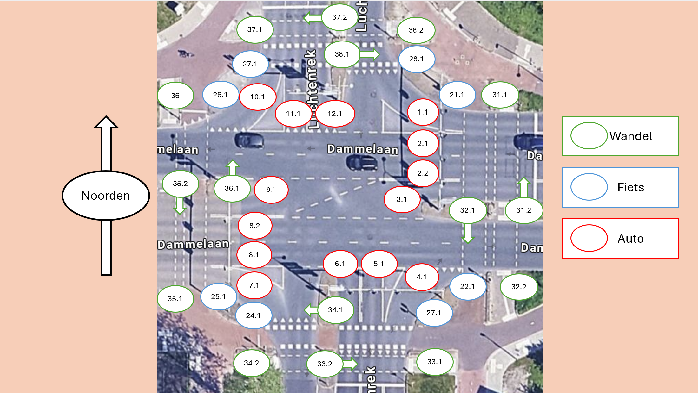

> [!Warning] 
> Het [json bestand](./lanes.json) is nog niet af. 
> Tot nu toe wordt de brug en de fiets-kruisingen daar omheen niet mee gerekend.
> Deze wordt later toegevoegd 

Deze directory bevat een [json bestand](./lanes.json) die de attributen van verschillende stoplichten en hun rijbanen opslaat.
De belangrijkste informatie hier is welke banen een intersectie hebben met elkaar. 
(De stoplichten van deze banen zouden nooit op hetzelfde moment op groen mogen staan)

Dit bestand is gemaakt op basis van dit mooie kaartje van Danny:

En dit nog mooiere kaartje van Jorrit:

# Wat heb ik hier aan?
Dit bestand is gemaakt met een implementatie van een *controller* als target audience.
Je kan dit bestand in je controller inladen zodat deze de informatie over de rijbanen kan gebruiken bij besluitvorming.
Dit zodat niet elk groepje hoeft te hard-coden welke baan intersect met welke andere banen.

Advies om dit bestand één keer te parsen bij het opstarten van je controller, en om te zetten naar een object die native is aan je programmeertaal.

Er zijn twee manieren voor je controller om dit bestand te bereiken:
1. Je kopieert en plakt het [json bestand](./lanes.json) naar een bestand die je progamma lokaal kan inlezen. (of naar de broncode van het programma zelf, ik kijk niet mee)
2. Je programma load het bestand live van ``https://raw.github.com/jorrit200/stoplicht-communicatie-spec/main/intersectionData/lanes.json`` elke keer dat het opstart.

Als je het bestand lokaal plaatst weet je zeker dat je controller zich altijd hetzelfde zal gedragen. Maar als je het live ophaalt, en je een goede parser schrijft, heb je een controller die zich automatisch aanpast aan de afgesproken standaard

# Ik haat json parsen
Dan heb ik hier dit mooie intersectie tabelletje:

| 🚦 | 1 | 2 | 3 | 4 | 5 | 6 | 7 | 8 | 9 | 10 | 11 | 12 | 21 | 22 | 23 | 24 | 25 | 26 | 27 | 28 | 31 | 32 | 33 | 34 | 35 | 36 | 37 | 38 |
|----|---|---|---|---|---|---|---|---|---|----|----|----|----|----|----|----|----|----|----|----|----|----|----|----|----|----|----|----|
| 1  |   |   |   |   | x |   |   |   | x |    |    |    | x  |    |    |    |    |    |    | x  | x  |    |    |    |    |    |    | x  |
| 2  |   |   |   |   | x | x |   |   | x | x  | x  | x  | x  |    |    |    |    | x  |    |    | x  |    |    |    |    | x  |    |    |
| 3  |   |   |   |   | x | x | x | x |   |    | x  |    | x  |    |    | x  |    |    |    |    | x  |    |    | x  |    |    |    |    |
| 4  |   |   |   |   |   |   |   | x |   |    |    | x  |    | x  | x  |    |    |    |    |    |    | x  | x  |    |    |    |    |    |
| 5  | x | x | x |   |   |   |   | x | x |    |    | x  |    |    | x  |    |    |    |    | x  |    |    | x  |    |    |    |    | x  |
| 6  |   | x | x |   |   |   |   | x | x | x  | x  | x  |    |    | x  |    |    | x  |    |    |    |    | x  |    |    | x  |    |    |
| 7  |   |   | x |   |   |   |   |   |   |    | x  |    |    |    |    | x  | x  |    |    |    |    |    |    | x  | x  |    |    |    |
| 8  |   |   | x | x | x | x |   |   |   |    | x  | x  |    | x  |    |    | x  |    |    |    |    | x  |    |    | x  |    |    |    |
| 9  | x | x |   |   | x | x |   |   |   |    | x  | x  |    |    |    |    | x  |    |    | x  |    |    |    |    | x  |    |    | x  |
| 10 |   | x |   |   |   | x |   |   |   |    |    |    |    |    |    |    |    | x  | x  |    |    |    |    |    |    | x  | x  |    |
| 11 |   | x | x |   |   | x | x | x | x |    |    |    |    |    |    | x  |    |    | x  |    |    |    |    | x  |    |    | x  |    |
| 12 |   | x |   | x | x | x |   | x | x |    |    |    |    | x  |    |    |    |    | x  |    |    | x  |    |    |    |    | x  |    |
| 21 | x | x | x | x |   |   |   | x |   |    |    | x  |    |    |    |    |    |    |    |    |    |    |    |    |    |    |    |    |
| 22 | x | x | x | x |   |   |   | x |   |    |    | x  |    |    |    |    |    |    |    |    |    |    |    |    |    |    |    |    |
| 23 |   |   | x | x | x | x | x |   |   |    | x  |    |    |    |    |    |    |    |    |    |    |    |    |    |    |    |    |    |
| 24 |   |   | x | x | x | x | x |   |   |    | x  |    |    |    |    |    |    |    |    |    |    |    |    |    |    |    |    |    |
| 25 |   | x |   |   |   | x | x | x | x | x  |    |    |    |    |    |    |    |    |    |    |    |    |    |    |    |    |    |    |
| 26 |   | x |   |   |   | x | x | x | x | x  |    |    |    |    |    |    |    |    |    |    |    |    |    |    |    |    |    |    |
| 27 | x |   |   |   | x |   |   |   | x | x  | x  | x  |    |    |    |    |    |    |    |    |    |    |    |    |    |    |    |    |
| 28 | x |   |   |   | x |   |   |   | x | x  | x  | x  |    |    |    |    |    |    |    |    |    |    |    |    |    |    |    |    |
| 31 | x | x | x |   |   |   |   |   |   |    |    |    |    |    |    |    |    |    |    |    |    |    |    |    |    |    |    |    |
| 32 |   |   |   | x |   |   |   | x |   |    |    | x  |    |    |    |    |    |    |    |    |    |    |    |    |    |    |    |    |
| 33 |   |   |   | x | x | x |   |   |   |    |    |    |    |    |    |    |    |    |    |    |    |    |    |    |    |    |    |    |
| 34 |   |   | x |   |   |   | x |   |   |    | x  |    |    |    |    |    |    |    |    |    |    |    |    |    |    |    |    |    |
| 35 |   |   |   |   |   |   | x | x | x |    |    |    |    |    |    |    |    |    |    |    |    |    |    |    |    |    |    |    |
| 36 |   | x |   |   |   | x |   |   |   | x  |    |    |    |    |    |    |    |    |    |    |    |    |    |    |    |    |    |    |
| 37 |   |   |   |   |   |   |   |   |   | x  | x  | x  |    |    |    |    |    |    |    |    |    |    |    |    |    |    |    |    |
| 38 | x |   |   |   | x |   |   |   | x |    |    |    |    |    |    |    |    |    |    |    |    |    |    |    |    |    |    |    |

En dan mag je dat lekker handmatig gaan implementeren in je controller.