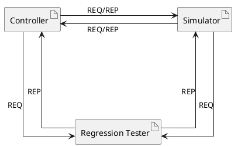
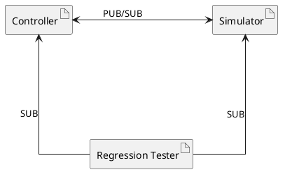
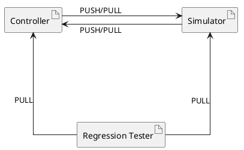
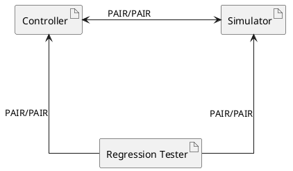
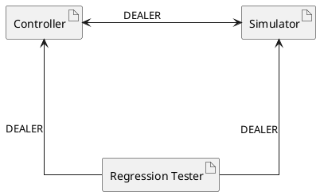
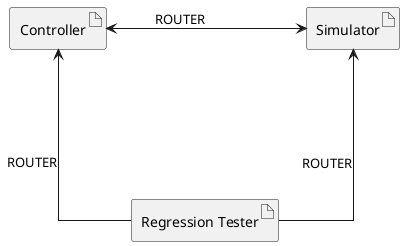

# ZeroMQ message patterns
In dit document worden ZeroMQ berichtpatronen en hoe deze mogelijk in het project gebruikt kunnen worden uitgewerkt.
## Beschikbare patterns
 
- Request-Reply
- Pub-Sub
- Pipeline
- Exclusive Pair
- Dealer - Dealer
- Router - Router

### Request - Reply

Bij dit patroon sturen de sockets om de beurt naar elkaar. Dit kan mogelijk gebruikt worden om de state op te vragen. Zie [hier](https://zeromq.org/socket-api/?language=c&library=libzmq#request-reply-pattern) voor de documentatie

| Socket | Richting | Framing | Notities |
| :- | :-: | :- | :- |
| [REQ](https://zeromq.org/socket-api/?language=c&library=libzmq#req-socket) | TX | DIY Framing | Kan niks sturen als er nog een reply verwacht wordt |
| [REP](https://zeromq.org/socket-api/?language=c&library=libzmq#rep-socket) | RX | DIY Framing | Kan niks sturen als er nog een request verwacht wordt |

Tabel 1   Sockets van Request - Reply patroon

#### Mogelijk gebruik voor project

Figuur 1 Voorbeeld Request - Reply architectuur

De simulator kan met een REQ socket bij de REP socket van de controller vragen (met de data van de simulatie state) om de state van alle stoplichten. De controller geeft dit dan als een reply terug. 
Voor de regressie tester wordt de data die de controller en simulator binnenkrijgen direct doorgestuurd via een extra PUSH naar de regressie tester, deze moet dan vervolgens met een leeg bericht antwoorden op de REP.

### Publish - Subscribe

Bij dit patroon verbindt een SUB socket op een PUB socket om data op diverse topics te ontvangen. Zie [hier](https://zeromq.org/socket-api/#publish-subscribe-pattern) voor de documentatie.

| Socket | Richting | Framing | Notities |
| :- | :-: | :- | :- |
| [PUB](https://zeromq.org/socket-api/#pub-socket) | TX | Multipart, eerst topic en daarna data |
| [SUB](https://zeromq.org/socket-api/#sub-socket) | RX | Zoals PUB stuurt | Verstuurt niks naar PUB
| [XPUB](https://zeromq.org/socket-api/#xpub-socket) | TX | Net zoals PUB | Ontvangt subscription requests van XSUB. Ondersteunt ook SUB.
| [XSUB](https://zeromq.org/socket-api/#xsub-socket) | RX | Net zoals PUB | Stuurt een subscription

Tabel 2 Sockets van Publish - Subscribe patroon

#### Mogelijk gebruik voor project

Figuur 2 Voorbeeld Publish - Subscribe architectuur

De simulator en controller kunnen beide een PUB en een SUB socket openen, waarna ze via hun SUB sockets op elkaars PUB sockets verbinden om zo naar elkaar berichten naar elkaar te sturen en van elkaar te ontvangen. 
Hierbij kan bijvoorbeeld gebruik gemaakt worden van topics zoals `simulator/SensorUpdate` of `controller/LightsUpdate`. 
De regressietester kan alle berichten afluisteren door een subscriptie af te nemen op zowel de controller als de simulator.

### Pipeline

Bij dit patroon wordt er van de PUSH socket gegevens naar PULL sockets gestuurd. Dit patroon is vergelijkbaar met Request-Reply, alleen komt er geen antwoord terug van de clients. Zie [hier](https://zeromq.org/socket-api/#pipeline-pattern) voor de documentatie.

| Socket | Richting | Framing | Notities |
| :- | :-: | :- | :- |
| [PUSH](https://zeromq.org/socket-api/#push-socket) | TX | DIY | |
| [PULL](https://zeromq.org/socket-api/#pull-socket) | RX | DIY | |

Tabel 3 Sockets van Pipeline patroon

#### Mogelijk gebruik voor project

Figuur 3 Voorbeeld Pipeline architectuur

De simulator en controller kunnen net zoals bij het Publish-Subscribe patroon beide een PUSH en een PULL socket openen, en van de PUSH socket naar elkaars PULL socket de berichten te sturen. 
Hierbij is het niet mogelijk om van beide kanten direct antwoord terug te geven, behalve als de kant zijn eigen PUSH socket gebruikt om antwoord te bieden. 
De regresietester kan alle berichten afluisteren door met twee PULL sockets op de controller en simulator te verbinden.

### Exclusive Pair

Bij het exclusive pair patroon verbinden twee PAIR sockets met elkaar en kunnen beide frames versturen en ontvangen. 
Dit patroon is eigenlijk bedoeld voor in-process communicatie tussen threads. Als een PAIR socket verbindt op een andere PAIR die al een verbinding heeft, dan dropt deze PAIR de bestaande verbinding om de nieuwe verbinding te accepteren.

| Socket | Richting | Framing | Notities |
| :- | :-: | :- | :- |
| [PAIR](https://zeromq.org/socket-api/#pair-socket) | TX/RX | DIY | |

Tabel 4 Sockets van Exclusive Pair patroon

#### Mogelijk gebruik voor project

Figuur 4 Voorbeeld Exclusive Pair architectuur

Hierbij kan hetzelfde patroon gehanteerd worden als bij Request-Reply omdat deze sockets ook werken over de andere zeromq transporten buiten `inproc`. Er moet hier wel gelet worden op de nadelen die bij de PAIR sockets komen. 
Bij dit patroon moeten er 4 sockets zijn op de controller en simulator en 2 op de regressie tester om deze onderling te verbinden. 

### Dealer - Dealer

Dit patroon is vergelijkbaar met Request-Reply, alleen is het ontvangen en versturen van frames asynchroon en wacht de DEALER dus niet op antwoord. Ook zijn er minder sockets nodig, omdat DEALER sockets op meerdere sockets kunnen verbinden of verbinding van krijgen.

| Socket | Richting | Framing | Notities |
| :- | :-: | :- | :- |
| [DEALER](https://zeromq.org/socket-api/#dealer-socket) | TX/RX | DIY | Verstuurt asynchroon |

Tabel 5 Sockets van Dealer - Dealer patroon

#### Mogelijk gebruik voor project

Figuur 5 Voorbeeld Dealer - Dealer architectuur

Dit patroon is vergelijkbaar aan normale sockets, maar het versturen is multicast naar alle verbonden clients/servers. 
Bij dit patroon kan de regressie tester niet out of box zien waar berichten vandaan komen.

### Router - Router

Dit patroon is vergelijkbaar met Dealer - Dealer, alleen wordt er bij het ontvangen van berichten een frame toegevoegd die identificeert waar het bericht vandaan komt.

| Socket | Richting | Framing | Notities |
| :- | :-: | :- | :- |
| [ROUTER](https://zeromq.org/socket-api/#router-socket) | TX/RX | Multipart, identificatie + data | Verstuurt asynchroon |

Tabel 6 Sockets van Router - Router patroon

#### Mogelijk gebruik voor project

Figuur 6 Voorbeeld Router - Router architectuur

De gebruikswijze is vergelijkbaar met het Dealer - Dealer patroon, alleen kan de regressie tester wel zien waar het bericht vandaan komt omdat de ROUTER socket dit toevoegt aan een bericht bij het ontvangen. 